# 🎙️ SagalNet: Afaan Oromoo Spoken Digit Recognition

<div align="center">


**Real-time Spoken Digit Recognition using Deep Convolutional Neural Networks (CNNs).**

[📚 Read the Docs](docs/README.md) | [🚀 Quick Start](#quick-start) | [📊 Experiments](docs/04_experiments_and_results.md)

</div>

---

## 📖 Overview

**SagalNet** implements a robust machine learning pipeline to recognize spoken digits (0-9) in **Afaan Oromoo**. It leverages modern deep learning techniques, including **Mel-Spectrograms** for feature extraction and a custom **DeeperCNN** architecture for high-accuracy classification.

We focus on a complete **MLOps lifecycle**:
-   **Modular Codebase**: Clean separation of Data (`src/data`), Modeling (`src/models`), and UI.
-   **Experiment Tracking**: All runs are logged with **MLflow** (Metrics, Parameters, Models).
-   **Interactive UI**: A **Streamlit** app for real-time testing via microphone or file upload.

## ✨ Key Features

-   **🎙️ Live Recording**: Test the model instantly using your microphone.
-   **🧠 Advanced Architecture**: Custom `DeeperCNN` with BatchNorm, Dropout, and Adaptive Pooling.
-   **📈 SpecAugment**: Implements Time and Frequency masking for robust training.
-   **📊 Visualizations**: Real-time Mel-Spectrograms and Prediction Confidence bars.
-   **🛠️ Reproducible**: Full environment setup with `requirements.txt` and `venv`.

## 🚀 Quick Start

### 1. Clone & Setup
```bash
git clone https://github.com/abdulmunimjemal/SagalNet.git
cd SagalNet
python -m venv venv
source venv/bin/activate
pip install -r requirements.txt
```

### 2. Run the App
Launch the interactive UI to test the model:
```bash
streamlit run app.py
```
*Open [http://localhost:8501](http://localhost:8501) in your browser.*

### 3. Train the Model
Train a new model from scratch:
```bash
# Basic Training
python run.py train --epochs 30 --model_type deeper

# View Experiments
mlflow ui
```

## 🏗️ Architecture

The system converts raw audio into visual representations (Mel-Spectrograms) which are then processed by a Deep CNN.

```mermaid
graph LR
    A["🎙️ Audio Input"] --> B["🌊 Waveform"]
    B --> C["🖼️ Mel-Spectrogram"]
    C --> D["🧠 DeeperCNN"]
    D --> E["📊 Probability Distribution"]
    E --> F["✅ Prediction"]
```



*See [docs/02_architecture.md](docs/02_architecture.md) for detailed diagrams.*

## 📊 Results

| Model | Epochs | Accuracy | F1-Score |
| :--- | :--- | :--- | :--- |
| SimpleCNN | 30 | ~87% | 0.87 |
| **DeeperCNN** | **50** | **91.94%** | **0.9194** |

## 📂 Project Structure

```
├── app.py                  # Streamlit UI Entry point
├── notebooks/              # Jupyter Notebooks for analysis
├── src/
│   ├── data/               # Dataset loading & augmentation
│   ├── models/             # CNN Architectures & Training Loop
│   └── utils/              # Helper scripts
├── docs/                   # Detailed Documentation
├── requirements.txt        # Dependencies
└── run.py                  # CLI Entry point
```

