# 2. System Architecture

This document details the technical design of the system, from data flow to the deep learning model.

## 🏗️ High-Level Design

The system follows a modular **Model-View-Controller (MVC)** inspired pattern, adapted for ML applications.

```mermaid
graph TD
    User(("👤 User"))
    UI["🖥️ Streamlit App (View)"]
    Predict["⚙️ Inference Eng (Controller)"]
    Model["🧠 DeeperCNN (Model)"]
    Data["📂 Feature Extractor"]

    User -->|Uploads/Records| UI
    UI -->|Raw Audio| Predict
    Predict -->|Waveform| Data
    Data -->|Mel-Spectrogram| Model
    Model -->|Logits| Predict
    Predict -->|Probability| UI
```

1.  **View (`app.py`)**: Handles user interaction (recording/uploading).
2.  **Controller (`predict_model.py`)**: Orchestrates the logic. It loads the model, preprocesses audio, and interprets results.
3.  **Model (`src/models/model.py`)**: The pure PyTorch neural network.
4.  **Data (`src/data`)**: Handles the physics of audio conversion.

---

## 🌊 Data Processing Pipeline

Raw audio is not fed directly into the neural network. It must be converted into a visual representation that captures frequency patterns.

```mermaid
graph LR
    A["🎤 Rough Audio"] -->|Resample 16kHz| B["📉 Clean Waveform"]
    B -->|STFT + Mel Scale| C["🖼️ Melspectrogram (64xN)"]
    C -->|Log Scale| D["Decibel Spectrogram"]
    D -->|Normalize| E["Tensor (1, 64, N)"]
```

*   **Resampling**: Ensures all inputs match the training frequency (16kHz).
*   **Mel-Spectrogram**: A 2D image where Y-axis is Frequency (Mel scale) and X-axis is Time. Color represents Loudness (dB).

---

## 🧠 Model Architecture: `DeeperCNN`

We developed a custom Convolutional Neural Network (CNN) specifically for this task. It is deeper than standard tutorial models to capture the subtle nuances of Afaan Oromoo pronunciation.

### Layer Diagram

### Design Keypoints
1.  **Batch Normalization (BN)**: Applied after every convolution. This stabilizes training and allows for higher learning rates.
2.  **AdaptiveAvgPool**: We force the output of the feature extractor to be `4x4` regardless of the input audio length. This allows the model to handle audio of varying durations (to an extent).
3.  **Dropout**: We use aggressive dropout (0.5 and 0.3) in the fully connected layers to prevent overfitting, forcing the model to learn redundant features.

---
[Next: Setup & Usage ➡️](03_setup_and_usage.md)
